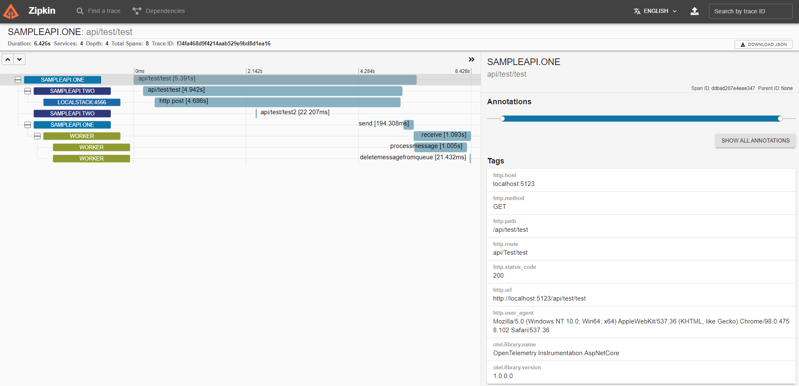
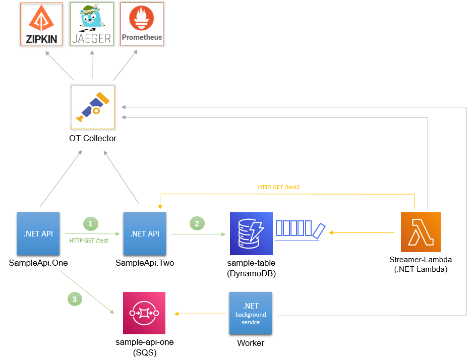
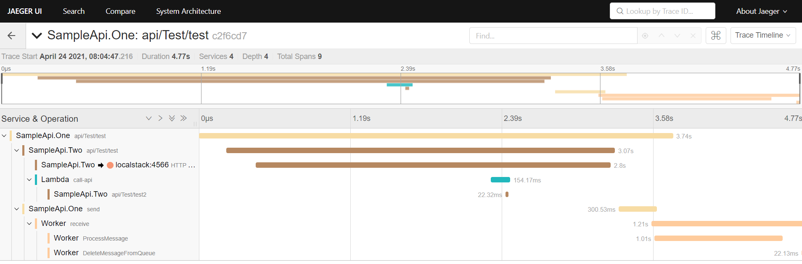

# Distributed Tracing Instrumentation Playground

This solution contains a set of C# services and AWS resources (run in localstack) to explore distributed tracing (intrumentation and visualization) with a concrete example that uses both async and sync communication. 


To run the solution, you only need docker installed. If you wish to extend the solution, it was developed for .NET SDK 3.1 originally. 

A test endpoint is made available for the user (us). When called, the first API (`SampleApi.One`) is calling another API (`SampleApi.Two`) which in turn put a item in a DynamoDB table (`sample-table`). Once the response is retured, the first API publishing a message to a SQS queue (`sample-api-one`). In an asynchronous manner, a function (`Streamer-Lambda`) listens to newly inserted item in dynamodb using DynamoDB streams and a background service (`Worker`) listen to the published SQS messages. Using a correlation ID, we can trace back the original request to `SampleApi.One` even accross the async process. If we were to use batch of messages/events here, we would not lose the track of our IDs.

## Getting Started

You can choose two options to get started with this solution:
- Zipkin backend option is a very simple example that reuses its own exporter.
- OTEL collector option is a more detailed example, that shows how to use OpenTelemetry to deliver both backend solutions that are Zipkin and Jaeger.  

Both option uses OpenTelemetry standards for instrumentation. An example of auto-instrumentation for http requests (AddAspNetCoreInstrumentation) was added, as well as custom ones (e.g. SQS) when no automated solution available.

### Notes

There could be a short delay between the creation of the queue in localstack and the worker starting. The worker log will show exceptions but retry until successful so this should take a few second for everything to be up and running.

### Example with Zipkin Backend

Using Zipkin, we push traces directly to the Zipkin server (docker container here). The setup in the application consists of specify the URL of the Zipkin server to push to. A background process will run alongside your code and push traces for you in a transparent way. 


To get started, run the following command:

```
docker-compose -f docker-compose.yml -f docker-compose-infra.yml -f docker-compose-zipkin.yml up --build
```

Once everything is up and running, call the following api endpoint to trigger a test: `http://localhost:5123/api/test/test`. 

You can access Zipkin backend on this URL: http://localhost:9411/. Please bear in mind that the results might take a few seconds to appear. 




The lambda was configured to use OTLP, to reconfigure the lambda for Zipkin, runs:

```shell
aws lambda update-function-configuration --function-name streamer-lambda --environment "Variables={Settings__DistributedTracingOptions__Exporter=ZipKin,Settings__DistributedTracingOptions__ZipkinEndpointUrl=http://host.docker.internal:9411/api/v2/spans, Settings__SampleApiTwoTestEndpointUrl=http://host.docker.internal:5124/api/test/test2, Serilog__WriteTo__1__Args__serverUrl=http://host.docker.internal:5341}" --endpoint-url http://localhost:4566 --region eu-west-2 
```

### Example with OTEL Collector

Using an OTLP collector, we push traces directly to the collector node (docker container here), that was configured to propagate traces to pre-defined backend. The setup in the application consists of specify the URL of the collector node to push to. A background process will run alongside your code and push traces for you in a transparent way. With OTLP collector, we can plugin more OTEL-compatible backends (such as Prometheus in the example). 



To get started, run the following command:

```
docker-compose -f docker-compose.yml -f docker-compose-infra.yml -f docker-compose-otel-collector.yml up --build
```

Once everything is up and running, call the following api endpoint to trigger a test: `http://localhost:5123/api/test/test`. 

You can access the different backends on this urls:
* Zipkin (traces): http://localhost:9411/
* Jaeger (traces): http://localhost:16686/
* Prometheus (OTLP metrics): http://localhost:9090/
    - [Example for app metrics](https://github.com/open-telemetry/opentelemetry-dotnet/blob/reyang/metrics/examples/Console/TestPrometheusExporter.cs)

Please bear in mind that the results might take a few seconds to appear.

A similar traces will appear in Zipkin and here the same trace on Jaeger. 



## Implementation notes

### Re-deploy the lambda

There are a few step to refresh the function once modified described below: 

Go to the MyLambda folder then run:
```
sh deploy_function.sh
```

To check the CW Logs:

```
aws logs filter-log-events --log-group-name "/aws/lambda/streamer-lambda" --endpoint-url http://localhost:4566 --region eu-west-2

aws logs get-log-events --log-group "/aws/lambda/streamer-lambda" --log-stream-name "<stream-name>" --endpoint-url http://localhost:4566 --region eu-west-2
```

eg. "logStreamName": "2021/04/11/[LATEST]84b11d1c"
