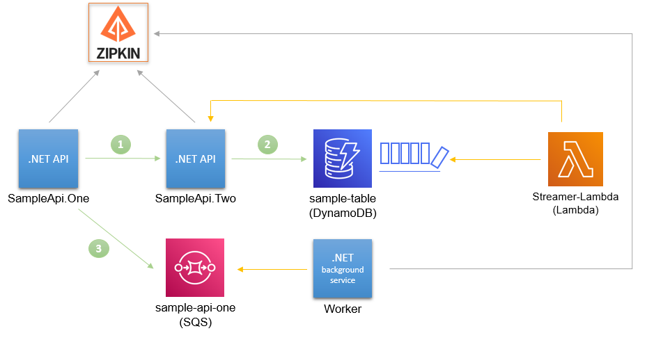

# OpenTelemetry Instrumentation

## Getting Started

### With Zipkin Backend

```
docker-compose -f docker-compose.yml -f docker-compose-zipkin.yml up --build
```

Zipkin: http://localhost:9411/

Architecture:



### With OTEL Collector

```
docker-compose -f docker-compose.yml -f docker-compose-otel-collector.yml up --build
```

Zipkin: http://localhost:9411/
Jaeger: http://localhost:16686/

Architecture:


### Endpoint URLs

Docker:
- SampleApi.One Test: http://localhost:5123/api/test/test
- SampleApi.Two Test: http://localhost:5124/api/test/test

Visual Studio:
- SampleApi.One Test: https://localhost:5001/api/test/test
- SampleApi.Two Test: https://localhost:5001/api/test/test
